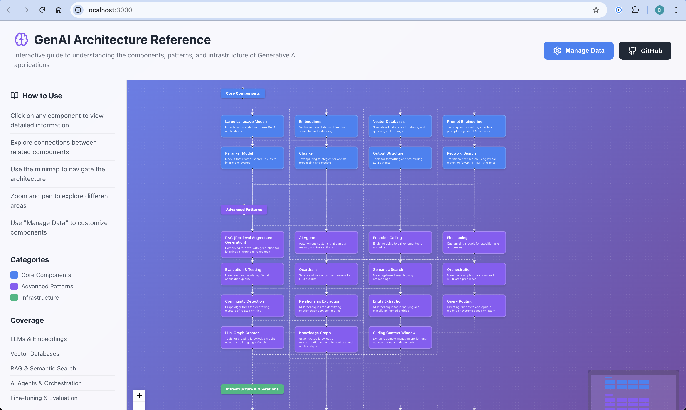
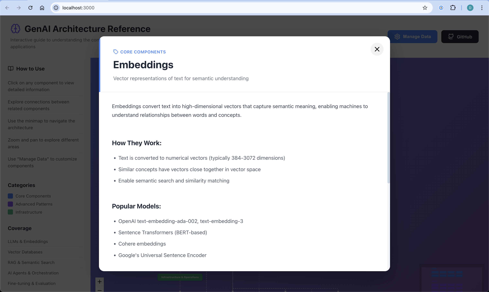

# GenAI Architecture Reference

An interactive web application that helps developers understand the components, patterns, and infrastructure of Generative AI applications.


## Overview

This application provides an interactive, visual reference guide to GenAI architecture. It covers:

- **Core Components**: LLMs, embeddings, vector databases, and prompt engineering
- **Advanced Patterns**: RAG, AI agents, fine-tuning, evaluation, and guardrails
- **Infrastructure**: Deployment, monitoring, scaling, security, and caching

## Screenshots

### Interactive Architecture Diagram

*Explore the complete GenAI architecture with interactive components and connections*

### Component Details Panel

*Detailed explanations, use cases, and best practices for each component*

## Features

- **Interactive Architecture Diagram**: Explore components and their relationships visually using ReactFlow
- **Detailed Component Information**: Click any component to view comprehensive explanations, use cases, and best practices
- **Connected Learning**: Navigate between related components to understand how they work together
- **Dynamic Data Management**: Add, edit, and customize components through the built-in data manager
- **Local Storage Persistence**: All customizations are saved locally in your browser
- **Data Import/Export**: Backup and share your custom architecture data
- **Responsive Design**: Works seamlessly on desktop and mobile devices
- **Beautiful UI**: Modern, gradient-based design with smooth animations

## Getting Started

### Prerequisites

- Node.js 16+ and npm

### Installation

1. Clone this repository:
```bash
git clone <your-repo-url>
cd ai-reference-architecture
```

2. Install dependencies:
```bash
npm install
```

3. Start the development server:
```bash
npm run dev
```

4. Open your browser to `http://localhost:3000`

### Building for Production

```bash
npm run build
```

The built files will be in the `dist` directory, ready to deploy to any static hosting service.

## Project Structure

```
ai-reference-architecture/
├── src/
│   ├── components/
│   │   ├── ArchitectureDiagram.jsx    # Interactive diagram component
│   │   ├── ArchitectureDiagram.css
│   │   ├── ComponentDetail.jsx         # Detail panel for components
│   │   ├── ComponentDetail.css
│   │   ├── DataManager.jsx            # Data management interface
│   │   └── DataManager.css
│   ├── data/
│   │   └── architectureData.js         # Dynamic data loading
│   ├── utils/
│   │   └── storageUtils.js             # LocalStorage utilities
│   ├── App.jsx                          # Main application component
│   ├── App.css
│   ├── main.jsx                         # Entry point
│   └── index.css                        # Global styles
├── index.html
├── package.json
├── vite.config.js
└── README.md
```

## Components Covered

### Core Components
- **Large Language Models**: Foundation models (GPT-4, Claude, Gemini, etc.)
- **Embeddings**: Vector representations for semantic understanding
- **Vector Databases**: Specialized databases for embeddings (Pinecone, Weaviate, etc.)
- **Prompt Engineering**: Techniques for effective prompting
- **Reranker Model**: Models that reorder search results to improve relevance
- **Chunker**: Text splitting strategies for optimal processing and retrieval
- **Output Structurer**: Tools for formatting and structuring LLM outputs
- **Keyword Search**: Traditional text search using BM25, TF-IDF, trigrams

### Advanced Patterns
- **RAG (Retrieval Augmented Generation)**: Knowledge-grounded responses
- **AI Agents**: Autonomous systems with planning and reasoning
- **Function Calling**: LLM integration with external tools
- **Fine-tuning**: Model customization
- **Evaluation & Testing**: Quality assurance
- **Guardrails**: Safety and validation
- **Semantic Search**: Meaning-based search
- **Orchestration**: Workflow management
- **Community Detection**: Graph algorithms for identifying clusters of related entities
- **Relationship Extraction**: NLP techniques for identifying relationships between entities
- **Entity Extraction**: NLP technique for identifying and classifying named entities
- **Query Routing**: Directing queries to appropriate models or systems based on intent
- **LLM Graph Creator**: Tools for creating knowledge graphs using Large Language Models
- **Knowledge Graph**: Graph-based knowledge representation connecting entities and relationships
- **Sliding Context Window**: Dynamic context management for long conversations and documents

### Infrastructure
- **Data Pipeline**: Data processing and preparation
- **Monitoring & Observability**: Production tracking
- **Deployment**: Deployment strategies
- **Scaling**: Performance optimization
- **Caching**: Cost and latency reduction
- **Security**: Threat protection

## Technology Stack

- **React 18**: UI framework
- **ReactFlow**: Interactive diagram visualization
- **Vite**: Build tool and dev server
- **Lucide React**: Icon library
- **React Router**: Navigation (if needed for future enhancements)

## Customization

### Dynamic Data Management

The application now includes a built-in data manager accessible via the "Manage Data" button in the header. This allows you to:

- **Add New Components**: Create custom architecture components
- **Edit Existing Components**: Modify titles, descriptions, details, and connections
- **Delete Components**: Remove components you don't need
- **Manage Categories**: Create and customize component categories
- **Import/Export Data**: Backup and share your custom architecture data
- **Reset to Defaults**: Restore the original component set

All changes are automatically saved to localStorage and persist between browser sessions.

### Manual Data Editing

You can still manually edit the default data in `src/utils/storageUtils.js` by modifying the `defaultArchitectureComponents` and `defaultCategories` objects.

### Adding Components Programmatically

Use the storage utilities in your code:

```javascript
import { updateComponent, loadArchitectureComponents } from './src/utils/storageUtils.js';

// Add a new component
updateComponent({
  id: "new-component",
  title: "New Component",
  category: "core",
  description: "Brief description",
  details: `Detailed information...`,
  connections: ["related-component-1"]
});
```

## License

MIT License - feel free to use this project for learning and commercial purposes.

## Support

If you find this helpful, please star the repository and share it with others building GenAI applications!

For issues or questions, please open a GitHub issue.

---

Built with ❤️ to help developers understand GenAI architectures
